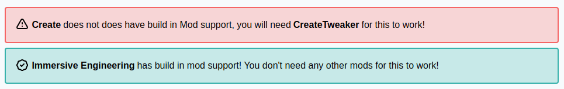
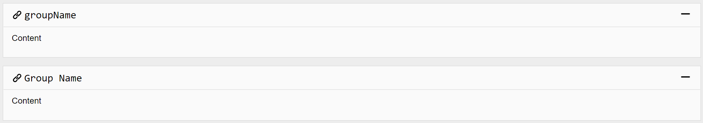

# CraftTweaker-Documentation

This repository contains the documentation for [CraftTweaker](https://github.com/CraftTweaker/CraftTweaker), a Minecraft mod that allows you to customize the game using a scripting language.

This repository is not meant to be used to view the documentation, instead you should visit [docs.blamejared.com](http://docs.blamejared.com).

## Setup:

Both node and pnpm are required to build the project.
```shell
node: "^>=18.17.1"
pnpm: "^9.12.1"
```

Clone the repository locally and install the dependencies.
```shell
git clone https://github.com/CraftTweaker/CraftTweaker-Documentation
pnpm install
```

This project uses pnpm workspaces, so you should **always run `pnpm install` from the top-level project directory**. Running `pnpm install` in the top-level project root will install dependencies for every package in the repo.

## Project Structure

```text
/
│ 🛈 Contains handwritten documentation files
├── docs/
│   │ 🛈 Contains the versions index, used to define versions and group them on the website.
│   ├── versions.json 
│   │ 🛈 Contains the handwritten documentation files for a specific version.
│   └── <version>/ 
│       │ 🛈 Contains the sidebar structure for the documentation.
│       └── docs.json 
│ 🛈 Contains auto-generated documentation files.
├── docs_exported/
│   │ 🛈 Contains the auto-generated documentation files for a specific version.
│   └── <version>/
│       │ 🛈 Contains the auto-generated documentation files for a specific mod.
│       └── <mod>/
│ 🛈 Contains the TypeScript projects that handle building and processing the documentation files into a website.
└── packages/
    │ 🛈 Handles merging, processing and exporting the documentation files before they are built into a website.
    ├── docs-build/
    │ 🛈 Contains the model for the json based documentation files, and general utilities used throughout the project.
    ├── docs-model/
    │ 🛈 Handles generating TypeSense search indexes for the website.
    ├── docs-search/
    │ 🛈 Astro based documentation website
    ├── docs-site/
    │ 🛈 Expressive-Code plugin to put a "copy" button in the title of the frame
    ├── ec-copy-in-frame/
    │ 🛈 Expressive-Code plugin to set the default frame title based on the language.
    ├── ec-default-frame-title/
    │ 🛈 Expressive-Code plugin to generate rich example comments.
    ├── ec-example-comment/
    │ 🛈 Expressive-Code plugin to override the language of a code block.
    ├── ec-language-override/
    │ 🛈 Expressive-Code plugin to put rainbow brackets in the code blocks.
    ├── ec-rainbow-brackets/
    │ 🛈 Remark plugin to inject the game version into links.
    ├── remark-inject-url-version/
    │ 🛈 Remark-Rehype plugin that provides renderers for custom markdown directives.
    ├── remark-rehype-renderers/
    │ 🛈 Remark plugin to generate searchable terms for the search index.
    ├── remark-search/
    │ 🛈 Remark plugin to convert tables to responsive html
    └── remark-table/
```

## Contributing Documentation

Handwritten documentation files are stored in the `docs` folder. Each version has its own folder, and each folder contains a `docs.json` file that defines the structure of the documentation for that version.

### Adding or Removing Files
If you add or remove a file, please make sure to update the `docs.json` file.

### Previewing Your Changes

To preview your changes as you are working on them, you should first build the documentation files and then start the website.

```shell
pnpm build
pnpm site-dev
```

You can then navigate to `http://localhost:4321` in your browser to preview the website.

Once the website is running, you can make changes to the files in `./packages/docs-site/src/docs/`. The website will automatically reload when you save a file.
When you are done making changes to the files, you can copy the files you changed back to the top level `./docs` folder.

This process is a bit cumbersome, but right now, it is the best way to preview your changes as you are working on them. We are open to suggestions on how to improve this process.

### Custom Markdown Directives

While most of the docs are written in GitHub Flavoured Markdown, we use the [Remark-Directive](https://github.com/remarkjs/remark-directive) plugin to create some elements that stand out and help the user.

#### Required Mods

To show that a mod is required for certain pages, we use the following syntax:

```markdown
::requiredMod[Create]{builtIn=false modLink=https://www.curseforge.com/minecraft/mc-mods/create requiredMod=CreateTweaker requiredModLink=https://www.curseforge.com/minecraft/mc-mods/createtweaker}

::requiredMod[Immersive Engineering]{builtIn=true}
```

`builtIn` defines whether the support is added by the mod in question (Like Thermal Series having the support be in their mod), or if an addon mod is required (Like CreateTweaker being required to add support for Create).

`modLink` is a link to the mod's project page.

`requiredMod` is the display name of the required addon.

`requiredModLink` is the link to the required addon's project page.

When rendered on the actual site, this turns into:


#### Groups

To group a section of a page together, allowing for it to be collapsed, you can use the following syntax:

```markdown
:::group{name=groupName}
Content
:::
```
or
```markdown
:::group{name="Group Name"}
Content
:::
```

`name` is the name of the group.

When rendered on the actual site, this turns into:


### Adding a New Version
**This is currently not implemented, to make a new version, copy the files from an older version folder, and update the versions.json file manually**

To add a new version to the site, simply run the following command:

```shell
pnpm new-version
```
and follow the prompts.

Once the files have been created, please go through and update any version numbers in the new files as needed, and remove any files that are no longer needed.

### Auto-Generated Documentation

The auto-generated documentation files are stored in the `docs_exported` folder. These files are generated by the [CraftTweaker-Annotation-Processors](https://github.com/CraftTweaker/CraftTweaker-Annotation-Processors) project and can be overwritten at random.

If you find an issue with the auto-generated documentation, it needs to be fixed in the java code of the project that has the issue, fixing it on this repository will only be a temporary fix until the next time the auto-generated documentation is updated.

Please see the [CraftTweaker-Annotation-Processors readme file](https://github.com/CraftTweaker/CraftTweaker-Annotation-Processors/blob/main/README.md) on how to set it up for your project. 

## Build

The project can be built using the following commands:
```shell
pnpm build
pnpm site-build
```

The output will be in the `./dist` folder and can be served using any static file server such as nginx.

## Commands

All commands are run from the root of the project, from a terminal:

| Command                | Action                                        |
|:-----------------------|:----------------------------------------------|
| `pnpm install`         | Installs dependencies                         |
| `pnpm site-dev`        | Runs the site in dev mode at `localhost:4321` |
| `pnpm site-build`      | Builds the site                               |
| `pnpm site-preview`    | Previews the built site                       |
| `pnpm site-full`       | Builds and previews the site                  |
| `pnpm search-generate` | Generates the TypeSense search index          |
| `pnpm build`           | Builds the documentation files                |
| `pnpm build-full`      | Builds the documentation files and the site   |