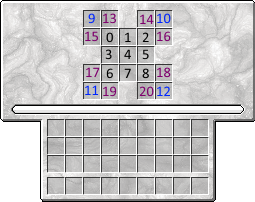

# 祭坛合成
你可以为星辉魔法的祭坛添加或移除合成表。


## 导入
使用`mods.astralsorcery.Altar`以导入祭坛相关包


## 祭坛等级
某些合成需要一定等级的祭坛:

|祭坛等级     | 此等级的祭坛名称        |
|------------|------------------------|
|0           |星辉合成台               |
|1           |星辉祭坛                 |
|2           |天辉祭坛                 |


## 移除祭坛合成

这个方法移除第一个在传入的祭坛等级下`输出`为传入的[物品堆](/Vanilla/Items/IItemStack)的合成。 
如果有多个合成表可以合成传入的物品，你需要多次使用这个方法。

```JAVA
//mods.astralsorcery.Altar.removeAltarRecipe(IItemStack output, int altarLevel);
//output：输出物品
//altarLevel：祭坛等级
mods.astralsorcery.Altar.removeAltarRecipe(<astralsorcery:blockblackmarble>, 0);
```


## 添加祭坛合成

所有添加合成表的的方法都需要以下参数：
[-[IItemStack](/Vanilla/Items/IItemStack) `output`,  
-int `starlightRequired`,  
-int `craftingTickTime`,  
-[IIngredient](/Vanilla/Variable_Types/IIngredient)[] `inputs`

不像工作台合成配方，`输入`参数是一维数组。
你可以使用[物品堆](/Vanilla/Items/IItemStack), [流体堆](/Vanilla/Liquids/ILiquidStack), [矿物词典条目](/Vanilla/OreDict/IOreDictEntry) 或者 `null` 作为数组的条目。

这些合成都不会是无序合成！


### 探索
`输入`长度*必须是* 9

`输入`顺序:  


```JAVA
mods.astralsorcery.Altar.addDiscoveryAltarRecipe(<minecraft:dirt>, 200, 200, [
			<minecraft:grass>, null, <ore:treeLeaves>,
			null, <minecraft:grass>, null,
			<liquid:astralsorcery.liquidstarlight>, null, <ore:treeLeaves>]);
```


### 共振

添加星辉祭坛（T2）的合成

`输入`长度*必须是* 13

`输入`顺序:  


```JAVA
mods.astralsorcery.Altar.addAttunmentAltarRecipe(<minecraft:dirt>, 500, 300, [
			null, null, null,
			<ore:treeLeaves>, <astralsorcery:blockmarble:2>, <ore:treeLeaves>,
			null, <liquid:astralsorcery.liquidstarlight>, null,
			<ore:blockMarble>, <ore:blockMarble>, <ore:blockMarble>, <ore:blockMarble>]);
```


### 星宿

添加天辉祭坛（T3）的合成

`输入`长度*必须是* 21

`输入`顺序:  


```JAVA
mods.astralsorcery.Altar.addConstellationAltarRecipe(<astralsorcery:itemcraftingcomponent:2>, 2000, 10, [
			<ore:blockMarble>, <astralsorcery:blocklens>, <ore:blockMarble>,
			<ore:blockMarble>, <astralsorcery:itemcraftingcomponent:2>, <ore:blockMarble>,
			<ore:blockMarble>, <minecraft:nether_star>, <ore:blockMarble>,
			null, null, <liquid:astralsorcery.liquidstarlight>, <liquid:astralsorcery.liquidstarlight>,
			<ore:blockMarble>, <ore:blockMarble>,
			<minecraft:nether_star>, <minecraft:nether_star>,
			<minecraft:nether_star>, <minecraft:nether_star>,
			<ore:blockMarble>, <ore:blockMarble>]);
```

### Trait

添加五彩祭坛（T4）的合成

`星座`为没有本地化的星座名称（字符串）。这是一个可选参数。

`输入`长度*必需为*25或者更高。在第25之后的物品将会被认为是“外部”物品，需要放在祭坛周围的光波增幅器中。

`输入` 顺序:  


```JAVA
//mods.astralsorcery.Altar.addTraitAltarRecipe(IItemStack output, int starlight, int craftTickTime, IIngredient[] inputs, @optional String iRequiredConstellationFocusName);
//output：输出物品
//starlight：所需星能
//craftTickTime：合成时间
//iRequiredConstellationFocusName：可选参数，需要的星座名称

mods.astralsorcery.Altar.addTraitAltarRecipe(<minecraft:tnt>, 4500, 100, [
	<liquid:lava>, <liquid:lava>, <liquid:lava>,<liquid:lava>, <minecraft:gunpowder>, 
	<liquid:lava>, <liquid:lava>, <liquid:lava>, <liquid:lava>,null, 
	null, null, null,<ore:blockMarble>, <ore:blockMarble>,
	<astralsorcery:itemusabledust>, <astralsorcery:itemusabledust>, <astralsorcery:itemusabledust>, <astralsorcery:itemusabledust>,<ore:blockMarble>, 
	<ore:blockMarble>,<minecraft:redstone>, <minecraft:redstone>,<minecraft:redstone>, <minecraft:redstone>,
	//外部物品,即序号25以上的
	<minecraft:sand>, <minecraft:sand>, <minecraft:sand>, <minecraft:sand>, <minecraft:sand>
],
"astralsorcery.constellation.evorsio");
```
