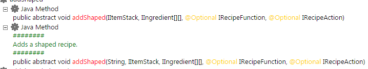

# ZenDoc

La anotación `@ZenDoc` permite a los desarrolladores proporcionar información adicional al comando `/ct dumpZS` .  
Más específicamente, se verá así:



## Ejemplo

[Proyecto de prueba de CraftTweaker ZenDoc](https://github.com/jaredlll08/CraftTweaker/tree/1.12/CraftTweaker2-MC1120-Tests/src/main/java/crafttweaker/tests/wiki/ZenDocWiki.java)

```java
@ZenClass(value = "crafttweaker.tests. enDoc")
@ZenRegister
public class ZenDocWiki {
    @ZenMethod
    @ZenDoc("Esto imprime una advertencia")
    public static void print() {
        CraftTweakerAPI. ogWarning("Imprimir invocado!");
    }
}
```

## Qué métodos se pueden anotar || Información adicional

- Puede anotar todos los métodos, estáticos y no estáticos.
- Actualmente, esto solo afectará al archivo HTML generado al ejecutar [`/ct dumpzs`](/Vanilla/Commands/).
- Esta anotación toma una Cadena como valor que es la información adicional que debe imprimirse.