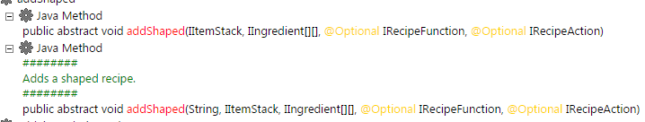

# ZenDoc

L'annotation `@ZenDoc` permet aux développeurs de fournir des informations supplémentaires à la commande `/ct dumpZS` .  
Plus spécifiquement, il ressemblera à ceci :



## Exemple

[Projet de test ZenDoc CraftTweaker](https://github.com/jaredlll08/CraftTweaker/tree/1.12/CraftTweaker2-MC1120-Tests/src/main/java/crafttweaker/tests/wiki/ZenDocWiki.java)

```java
@ZenClass(value = "crafttweaker.tests. frDoc")
@ZenRegister
classe publique ZenDocWiki {
    @ZenMethod
    @ZenDoc("Ceci affiche un avertissement")
    public static void print() {
        CraftTweakerAPI. ogWarning("Imprimer appelé!");
    }
 } }
```

## Quelles méthodes peuvent être annotées || Informations supplémentaires

- Vous pouvez annoter toutes les méthodes, statiques et non statiques.
- Actuellement, cela n'affectera que le fichier HTML généré lors de l'exécution de [`/ct dumpzs`](/Vanilla/Commands/).
- Cette annotation prend une chaîne de caractères comme valeur qui est l'information supplémentaire qui doit être imprimée.