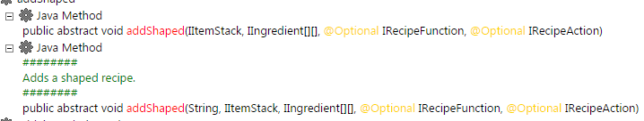

# ZenDoc

The `@ZenDoc` annotation allows developers to provide additional information to the `/ct dumpZS` command.  
More specifically, it will look like this:



## Beispiel

[CraftTweaker Test Project ZenDoc](https://github.com/jaredlll08/CraftTweaker/tree/1.12/CraftTweaker2-MC1120-Tests/src/main/java/crafttweaker/tests/wiki/ZenDocWiki.java)

```java
@ZenClass(value = "crafttweaker.tests.zenDoc")
@ZenRegister
public class ZenDocWiki {
    @ZenMethod
    @ZenDoc("This prints a warning")
    public static void print() {
        CraftTweakerAPI.logWarning("Print invoked!");
    }
}
```

## 什么方法可以被注解 || 额外信息

- 你可以注解所有的方法，包括静态的和非静态的。
- 目前，这只会在运行 [`/ct dumpzs`](/Vanilla/Commands/) 命令时影响生成的 HTML。
- 这个注解将一个字符串值作为应显示的额外信息。